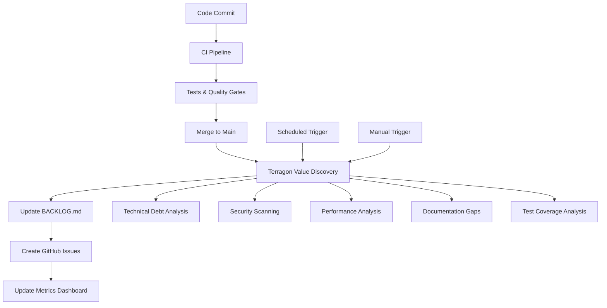

# 🔄 Terragon Integration Guide
*Autonomous Value Discovery System for CI/CD Pipeline*

## Overview

This document outlines how to integrate Terragon's autonomous value discovery system into your CI/CD pipeline for continuous backlog management and value optimization.

## 🏗️ Architecture Integration

### Current SDLC Maturity Assessment
- **Repository**: perspective-world-model-kit (85-90% maturity)
- **Existing Tooling**: Comprehensive SDLC with Docker, monitoring, security scanning
- **Integration Point**: Post-merge hooks, scheduled discovery runs

### Integration Points



## 🚀 GitHub Actions Integration

### 1. Post-Merge Value Discovery

Create `.github/workflows/value-discovery.yml`:

```yaml
name: Autonomous Value Discovery

on:
  push:
    branches: [main]
  schedule:
    # Run weekly on Sundays at 2 AM UTC
    - cron: '0 2 * * 0'
  workflow_dispatch:
    inputs:
      analyzers:
        description: 'Specific analyzers to run (comma-separated)'
        required: false
        default: 'all'
        type: string

jobs:
  value-discovery:
    runs-on: ubuntu-latest
    permissions:
      contents: write
      issues: write
      pull-requests: write
    
    steps:
    - name: Checkout Repository
      uses: actions/checkout@v4
      with:
        fetch-depth: 0  # Full history for analysis
    
    - name: Set up Python
      uses: actions/setup-python@v4
      with:
        python-version: '3.11'
    
    - name: Install Dependencies
      run: |
        pip install PyYAML
        # Add other required dependencies
    
    - name: Install Repository Dependencies
      run: |
        pip install -e ".[dev]"
    
    - name: Run Value Discovery
      env:
        GITHUB_TOKEN: ${{ secrets.GITHUB_TOKEN }}
      run: |
        cd .terragon
        python discover.py --config config.yaml
    
    - name: Commit Updated Backlog
      uses: stefanzweifel/git-auto-commit-action@v5
      with:
        commit_message: '🤖 Update autonomous value discovery backlog'
        file_pattern: 'BACKLOG.md .terragon/reports/* .terragon/metrics.json'
        commit_author: 'Terragon Bot <terragon@noreply.github.com>'
    
    - name: Create High-Priority Issues
      env:
        GITHUB_TOKEN: ${{ secrets.GITHUB_TOKEN }}
      run: |
        python .terragon/create_issues.py --priority critical high
    
    - name: Update Metrics Dashboard
      env:
        PROMETHEUS_GATEWAY: ${{ secrets.PROMETHEUS_GATEWAY }}
      run: |
        python .terragon/push_metrics.py
```

### 2. Pull Request Analysis

Create `.github/workflows/pr-value-analysis.yml`:

```yaml
name: PR Value Analysis

on:
  pull_request:
    types: [opened, synchronize, reopened]

jobs:
  incremental-analysis:
    runs-on: ubuntu-latest
    
    steps:
    - name: Checkout PR
      uses: actions/checkout@v4
      with:
        fetch-depth: 0
    
    - name: Set up Python
      uses: actions/setup-python@v4
      with:
        python-version: '3.11'
    
    - name: Install Dependencies
      run: |
        pip install PyYAML
        pip install -e ".[dev]"
    
    - name: Run Incremental Analysis
      run: |
        # Analyze only changed files
        git diff --name-only HEAD~1 | grep -E '\.(py|yml|yaml|toml)$' > changed_files.txt
        python .terragon/analyze_diff.py --files changed_files.txt
    
    - name: Comment on PR
      uses: actions/github-script@v7
      with:
        script: |
          const fs = require('fs');
          const analysis = JSON.parse(fs.readFileSync('.terragon/pr_analysis.json', 'utf8'));
          
          const comment = `## 🎯 Value Discovery Analysis
          
          This PR introduces **${analysis.new_items}** new value items:
          - 🔴 Critical: ${analysis.priority_counts.critical || 0}
          - 🟠 High: ${analysis.priority_counts.high || 0}
          - 🟡 Medium: ${analysis.priority_counts.medium || 0}
          
          **Estimated Technical Debt**: ${analysis.debt_score.toFixed(1)}/10
          **Security Risk**: ${analysis.security_score.toFixed(1)}/10
          
          ${analysis.summary}`;
          
          github.rest.issues.createComment({
            issue_number: context.issue.number,
            owner: context.repo.owner,
            repo: context.repo.repo,
            body: comment
          });
```

## 🔗 Integration Scripts

### 1. Issue Creation Script

Create `.terragon/create_issues.py`:

```python
#!/usr/bin/env python3
"""
Create GitHub issues from high-priority value items
"""

import json
import os
import sys
from pathlib import Path
import requests
import argparse

def create_github_issue(item, repo_owner, repo_name, token):
    """Create a GitHub issue from a value item"""
    
    # Priority emoji mapping
    priority_emoji = {
        'critical': '🔴',
        'high': '🟠',
        'medium': '🟡',
        'low': '🟢'
    }
    
    # Create issue title
    title = f"{priority_emoji[item['priority']]} {item['title']}"
    
    # Create issue body
    body = f"""## Description

{item['description']}

## Value Assessment

- **Final Score**: {item['final_score']:.1f}/10
- **Priority**: {item['priority'].title()}
- **Category**: {item['category'].replace('_', ' ').title()}
- **Estimated Effort**: {item['estimated_hours']:.1f} hours

## Scoring Breakdown

- **WSJF Score**: {item['wsjf_score']:.1f}
- **ICE Score**: {item['ice_score']:.1f}
- **Technical Debt Score**: {item['technical_debt_score']:.1f}
- **Research Value Score**: {item['research_value_score']:.1f}

## Context

- **Source**: {item['source']}
- **Files Affected**: {', '.join(item['file_paths'][:5])}

## Acceptance Criteria

- [ ] Implement solution addressing the identified issue
- [ ] Add/update tests if applicable
- [ ] Update documentation if needed
- [ ] Verify improvement in relevant metrics

---

*This issue was automatically generated by Terragon Value Discovery System*
"""
    
    # Create labels
    labels = [
        'terragon',
        'value-discovery',
        f"priority-{item['priority']}",
        f"category-{item['category']}",
        f"effort-{item['estimated_hours']//5 + 1}d"  # Rough day estimate
    ]
    
    # API request
    url = f"https://api.github.com/repos/{repo_owner}/{repo_name}/issues"
    headers = {
        'Authorization': f'token {token}',
        'Accept': 'application/vnd.github.v3+json'
    }
    
    data = {
        'title': title,
        'body': body,
        'labels': labels
    }
    
    response = requests.post(url, json=data, headers=headers)
    
    if response.status_code == 201:
        issue_url = response.json()['html_url']
        print(f"✅ Created issue: {issue_url}")
        return True
    else:
        print(f"❌ Failed to create issue for {item['title']}: {response.text}")
        return False

def main():
    parser = argparse.ArgumentParser()
    parser.add_argument('--priority', nargs='+', default=['critical', 'high'],
                       help='Priority levels to create issues for')
    parser.add_argument('--max-issues', type=int, default=10,
                       help='Maximum number of issues to create')
    args = parser.parse_args()
    
    # Get GitHub token
    token = os.environ.get('GITHUB_TOKEN')
    if not token:
        print("❌ GITHUB_TOKEN environment variable not set")
        return 1
    
    # Get repository info
    repo = os.environ.get('GITHUB_REPOSITORY', 'your-org/perspective-world-model-kit')
    repo_owner, repo_name = repo.split('/')
    
    # Load latest value items
    reports_dir = Path('.terragon/reports')
    latest_report = sorted(reports_dir.glob('value_items_*.json'))[-1]
    
    with open(latest_report) as f:
        items = json.load(f)
    
    # Filter by priority
    filtered_items = [item for item in items if item['priority'] in args.priority]
    
    # Limit number of issues
    items_to_create = filtered_items[:args.max_issues]
    
    print(f"🚀 Creating {len(items_to_create)} GitHub issues...")
    
    created_count = 0
    for item in items_to_create:
        if create_github_issue(item, repo_owner, repo_name, token):
            created_count += 1
    
    print(f"✅ Created {created_count}/{len(items_to_create)} issues")
    return 0

if __name__ == '__main__':
    sys.exit(main())
```

### 2. Metrics Push Script

Create `.terragon/push_metrics.py`:

```python
#!/usr/bin/env python3
"""
Push Terragon metrics to Prometheus Gateway
"""

import json
import os
import sys
import requests
from datetime import datetime

def push_to_prometheus_gateway(metrics, gateway_url, job_name='terragon'):
    """Push metrics to Prometheus Gateway"""
    
    # Format metrics for Prometheus
    prometheus_metrics = []
    
    # Total items metric
    prometheus_metrics.append(f'terragon_total_items{{repository="pwmk"}} {metrics["total_items"]}')
    
    # Priority distribution
    for priority, count in metrics['priority_distribution'].items():
        prometheus_metrics.append(f'terragon_priority_items{{priority="{priority}",repository="pwmk"}} {count}')
    
    # Category distribution
    for category, count in metrics['category_distribution'].items():
        prometheus_metrics.append(f'terragon_category_items{{category="{category}",repository="pwmk"}} {count}')
    
    # Average scores
    for score_type, value in metrics['average_scores'].items():
        prometheus_metrics.append(f'terragon_avg_score{{type="{score_type}",repository="pwmk"}} {value:.2f}')
    
    # Total effort
    prometheus_metrics.append(f'terragon_total_effort_hours{{repository="pwmk"}} {metrics["total_estimated_hours"]}')
    
    # Last update timestamp
    prometheus_metrics.append(f'terragon_last_update{{repository="pwmk"}} {int(datetime.now().timestamp())}')
    
    # Send to Prometheus Gateway
    metrics_data = '\n'.join(prometheus_metrics)
    
    url = f"{gateway_url}/metrics/job/{job_name}"
    response = requests.post(url, data=metrics_data)
    
    if response.status_code == 200:
        print("✅ Metrics pushed to Prometheus Gateway")
        return True
    else:
        print(f"❌ Failed to push metrics: {response.text}")
        return False

def main():
    # Get Prometheus Gateway URL
    gateway_url = os.environ.get('PROMETHEUS_GATEWAY')
    if not gateway_url:
        print("⚠️  PROMETHEUS_GATEWAY not configured, skipping metrics push")
        return 0
    
    # Load latest metrics
    metrics_file = '.terragon/metrics.json'
    if not os.path.exists(metrics_file):
        print("❌ No metrics file found")
        return 1
    
    with open(metrics_file) as f:
        metrics = json.load(f)
    
    # Push to Prometheus
    if push_to_prometheus_gateway(metrics, gateway_url):
        return 0
    else:
        return 1

if __name__ == '__main__':
    sys.exit(main())
```

## 📊 Monitoring Integration

### Grafana Dashboard Configuration

Add Terragon metrics to your existing Grafana dashboard (`monitoring/grafana/dashboards/pwmk-dashboard.json`):

```json
{
  "dashboard": {
    "panels": [
      {
        "title": "Value Discovery Metrics",
        "type": "stat",
        "targets": [
          {
            "expr": "terragon_total_items{repository=\"pwmk\"}",
            "legendFormat": "Total Items"
          }
        ]
      },
      {
        "title": "Priority Distribution",
        "type": "piechart",
        "targets": [
          {
            "expr": "terragon_priority_items{repository=\"pwmk\"}",
            "legendFormat": "{{priority}}"
          }
        ]
      },
      {
        "title": "Technical Debt Trend",
        "type": "timeseries",
        "targets": [
          {
            "expr": "terragon_avg_score{type=\"technical_debt_score\",repository=\"pwmk\"}",
            "legendFormat": "Technical Debt Score"
          }
        ]
      }
    ]
  }
}
```

## 🔧 Configuration Management

### Environment Variables

Set these environment variables in your CI/CD system:

```bash
# GitHub Integration
GITHUB_TOKEN=<personal_access_token>
GITHUB_REPOSITORY=your-org/perspective-world-model-kit

# Prometheus Integration (Optional)
PROMETHEUS_GATEWAY=https://prometheus-gateway.yourorg.com

# Slack Integration (Optional)
SLACK_WEBHOOK_URL=https://hooks.slack.com/services/...

# Terragon Configuration
TERRAGON_CONFIG_PATH=.terragon/config.yaml
TERRAGON_MAX_ISSUES=10
TERRAGON_AUTO_CREATE_ISSUES=true
```

### Repository Settings

1. **Branch Protection**: Ensure `BACKLOG.md` updates don't require PR reviews
2. **Issue Labels**: Create labels for Terragon integration:
   - `terragon`
   - `value-discovery`
   - `priority-critical`, `priority-high`, etc.
   - `category-technical-debt`, `category-security`, etc.

## 📈 Success Metrics

Track these metrics to measure Terragon's effectiveness:

1. **Value Item Resolution Rate**: Percentage of discovered items resolved
2. **Technical Debt Reduction**: Trend in technical debt scores over time  
3. **Security Issue Detection**: Number of security issues found and fixed
4. **Research Productivity**: Correlation with paper publications and benchmarks
5. **Developer Satisfaction**: Survey metrics on backlog usefulness

## 🚨 Troubleshooting

### Common Issues

1. **Permission Errors**: Ensure GitHub token has `repo` and `issues` permissions
2. **Analysis Failures**: Check Python dependencies and file permissions
3. **Large Repositories**: Consider running incremental analysis for large codebases
4. **Rate Limiting**: Implement exponential backoff for GitHub API calls

### Debug Mode

Enable debug logging by setting:
```bash
export TERRAGON_DEBUG=true
export TERRAGON_LOG_LEVEL=DEBUG
```

## 🎯 Next Steps

1. **Pilot Integration**: Start with manual runs to validate the system
2. **Gradual Rollout**: Begin with post-merge triggers only
3. **Team Training**: Educate team on interpreting and acting on value items
4. **Feedback Loop**: Collect team feedback and iterate on scoring algorithms
5. **Advanced Features**: Add ML-based prediction of item resolution success

---

*This integration guide provides a comprehensive foundation for incorporating Terragon into your advanced SDLC pipeline. Adapt configurations based on your specific infrastructure and team needs.*