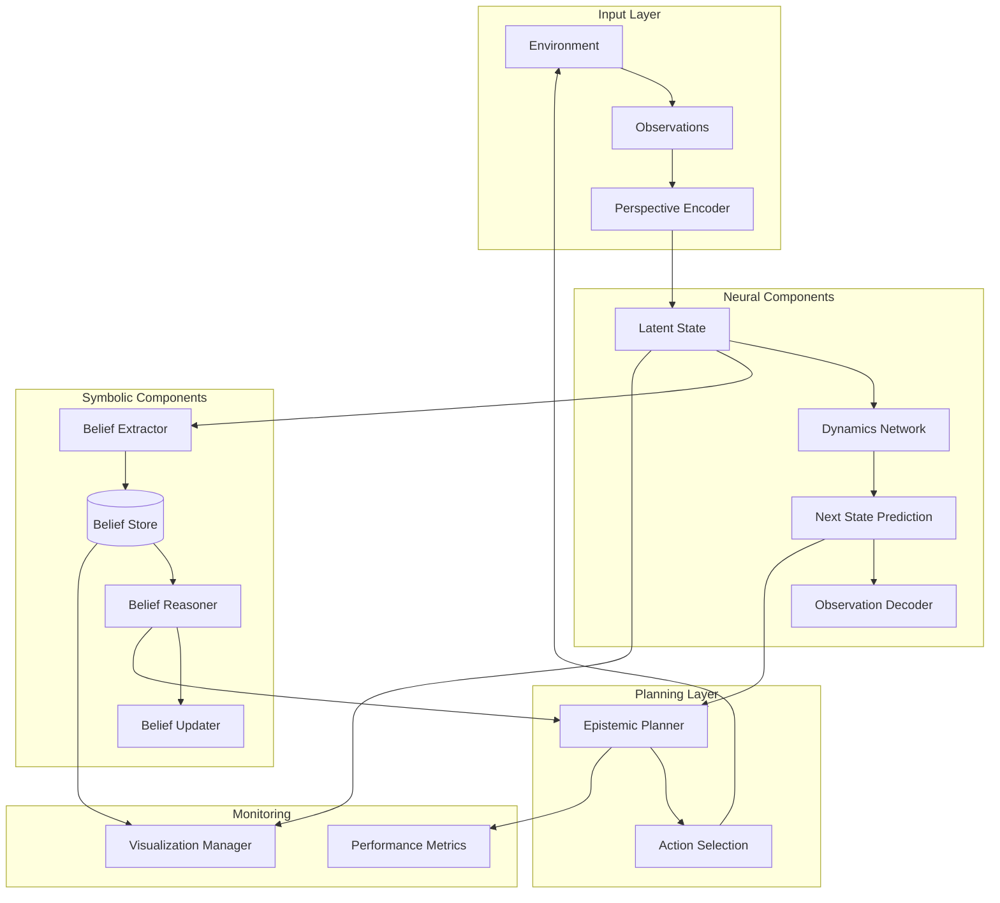
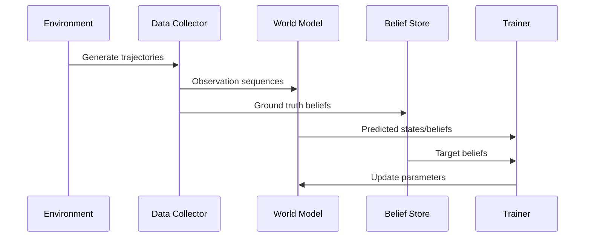
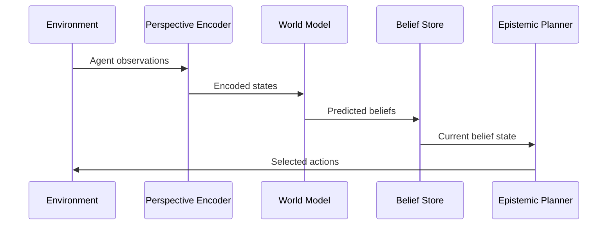
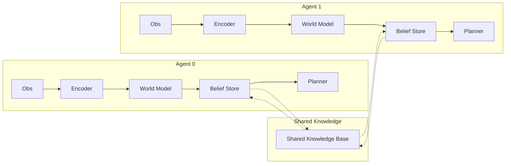

# Perspective World Model Kit - System Architecture

## Overview

The Perspective World Model Kit (PWMK) is a neuro-symbolic AI framework that combines transformer-based dynamics learning with Prolog-style belief reasoning for multi-agent systems. This document outlines the system's architectural design, component interactions, and data flows.

## System Design Principles

### 1. Modular Architecture
- **Separation of Concerns**: Neural dynamics, symbolic reasoning, and planning are distinct modules
- **Plugin Architecture**: Extensible backends for belief stores (Prolog, ASP, Clingo)
- **Environment Agnostic**: Support for Gym, Unity ML-Agents, and custom environments

### 2. Hybrid Intelligence
- **Neural-Symbolic Integration**: Learned dynamics with logical reasoning
- **Multi-Level Representation**: Continuous latent states + discrete symbolic beliefs
- **Epistemic Reasoning**: Theory of Mind capabilities with nested belief tracking

### 3. Scalability & Performance
- **Parallel Processing**: Multi-agent simulations with concurrent belief updates
- **Memory Efficiency**: Sparse belief representations and incremental updates
- **Configurable Complexity**: Adjustable ToM depth and reasoning horizon

## Component Architecture



## Core Components

### 1. Perspective Encoder
**Purpose**: Transform agent observations into latent representations that preserve perspective-specific information.

**Architecture**:
- Multi-head attention over observation features
- Agent-specific embedding layers
- Perspective-aware positional encodings

**Key Features**:
- Handles partial observability
- Maintains agent identity in shared latent space
- Supports visual and vector observations

### 2. Dynamics Network
**Purpose**: Learn forward dynamics in latent space while maintaining perspective coherence.

**Architecture**:
- Transformer-based sequence model
- Action conditioning via cross-attention
- Multi-agent interaction modeling

**Training Objectives**:
- Next state prediction loss
- Observation reconstruction loss
- Belief consistency regularization

### 3. Belief Store
**Purpose**: Maintain and query structured knowledge about agent beliefs and world state.

**Supported Backends**:
- **SWI-Prolog**: Full first-order logic reasoning
- **Clingo**: Answer Set Programming for consistency checking
- **Custom**: Optimized sparse representation for large-scale scenarios

**Belief Representation**:
```prolog
% First-order beliefs
believes(agent_0, has(agent_1, key)).
believes(agent_0, at(treasure, room_3)).

% Second-order beliefs (Theory of Mind)
believes(agent_0, believes(agent_1, location(treasure, room_3))).

% Conditional beliefs
believes(agent_0, implies(has(agent_1, key), can_unlock(agent_1, door))).
```

### 4. Epistemic Planner
**Purpose**: Generate action sequences that achieve goals while considering belief states.

**Planning Algorithms**:
- **Epistemic Forward Search**: BFS/DFS with belief state tracking
- **Belief MCTS**: Monte Carlo Tree Search in belief space
- **Hierarchical Planning**: Decompose epistemic goals into sub-problems

**Goal Specification**:
```python
goal = {
    "achievement": "has(agent_0, treasure)",
    "epistemic": [
        "believes(agent_1, at(agent_0, room_2))",
        "not(believes(agent_2, has(agent_0, key)))"
    ],
    "maintenance": ["safe(agent_0)"]
}
```

## Data Flow Architecture

### 1. Training Phase Flow


### 2. Inference Phase Flow


### 3. Multi-Agent Coordination


## System Interactions

### 1. Neural-Symbolic Interface
The integration between neural and symbolic components occurs at multiple levels:

**State Extraction**: Neural latent states are mapped to symbolic predicates via learned belief extractors.

**Belief Grounding**: Symbolic queries are grounded in continuous state representations for planning.

**Consistency Checking**: Symbolic reasoning validates neural predictions and triggers belief revision.

### 2. Environment Integration
The system supports multiple environment types through a unified interface:

**Gym Environments**: Standard RL interface with perspective-aware wrappers
**Unity ML-Agents**: 3D visual environments with belief annotation
**Custom Environments**: Domain-specific scenarios with rich symbolic structure

### 3. Planning Integration
Epistemic planning combines learned dynamics with symbolic reasoning:

**Forward Simulation**: Use world model for action effect prediction
**Belief Reasoning**: Query belief store for epistemic goal satisfaction
**Action Selection**: Choose actions that optimize both achievement and epistemic objectives

## Performance Characteristics

### 1. Scalability Metrics
- **Agents**: Tested up to 10 agents with 2nd-order Theory of Mind
- **Belief Complexity**: Supports 1000+ predicates with efficient sparse storage
- **Planning Horizon**: 50-step lookahead with belief state tracking

### 2. Memory Requirements
- **Latent States**: O(agents × hidden_dim) per timestep
- **Belief Storage**: O(predicates × belief_depth) sparse representation
- **Planning**: O(actions^horizon × belief_states) search space

### 3. Computational Complexity
- **Forward Pass**: O(sequence_length × hidden_dim²) transformer cost
- **Belief Update**: O(predicates × rules) Prolog inference
- **Planning**: O(horizon × branching_factor × belief_complexity)

## Extensibility Points

### 1. Custom World Models
Implement `CustomWorldModel` interface for domain-specific architectures:
- Custom perspective encoders
- Specialized dynamics networks
- Domain-specific belief extractors

### 2. Belief Store Backends
Add new reasoning engines by implementing `BeliefStore` interface:
- Alternative logic programming languages
- Probabilistic reasoning systems
- Distributed belief storage

### 3. Planning Algorithms
Extend `EpistemicPlanner` base class for new planning approaches:
- Reinforcement learning integration
- Multi-objective optimization
- Continual planning with belief updates

## Security Considerations

### 1. Belief Validation
- Input sanitization for symbolic queries
- Belief consistency checking to prevent contradictions
- Resource limits for reasoning computations

### 2. Model Security
- Parameter validation for neural components
- Safe serialization/deserialization of models
- Controlled execution environment for planning

### 3. Data Privacy
- Belief anonymization for multi-agent scenarios
- Secure communication protocols
- Audit logging for decision traceability

## Future Architecture Evolution

### 1. Distributed Systems
- Federated learning for multi-agent world models
- Distributed belief stores with consensus protocols
- Edge deployment for real-time applications

### 2. Advanced Reasoning
- Temporal logic integration for temporal beliefs
- Causal reasoning for counterfactual planning
- Uncertainty quantification in belief representation

### 3. Human-AI Interaction
- Natural language belief specification
- Interactive belief debugging tools
- Explainable decision interfaces

## Development and Deployment Architecture

### 1. Code Organization
- **Source Code**: Modular Python package structure in `pwmk/`
- **Tests**: Comprehensive test suite in `tests/`
- **Documentation**: API docs and tutorials in `docs/`
- **Examples**: Reference implementations in `examples/`

### 2. CI/CD Pipeline
- **Testing**: Automated testing across Python versions
- **Quality Gates**: Code formatting, linting, type checking
- **Documentation**: Automated doc building and deployment
- **Release**: Automated PyPI publishing for tagged releases

### 3. Monitoring and Observability
- **Performance Metrics**: Training loss, belief accuracy, planning success
- **System Metrics**: Memory usage, inference latency, reasoning time
- **Visualization**: Interactive belief graphs and model predictions