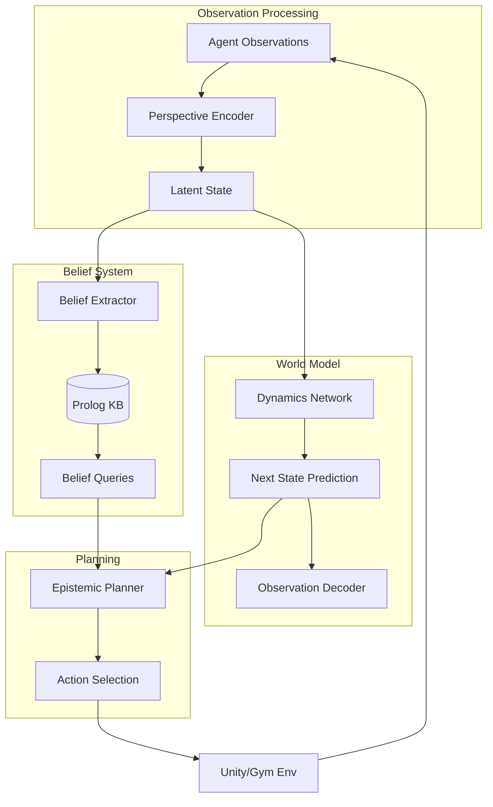

# perspective-world-model-kit

[](https://github.com/your-org/perspective-world-model-kit/actions)
[](LICENSE)
[](https://www.python.org/downloads/)
[](https://arxiv.org/abs/2503.20425)

Plug-and-play neuro-symbolic world models with Theory of Mind (ToM) belief tracking for multi-agent simulations. Combines transformer-based dynamics learning with Prolog-style belief reasoning and epistemic planning.

## 🎯 Key Features

- **Perspective-Aware Learning**: Neural networks that model each agent's partial observations
- **Symbolic Belief Store**: Prolog/ASP reasoning about nested beliefs ("A believes that B knows X")
- **Hybrid Planning**: Combine learned dynamics with logical constraints for robust planning
- **Gym Integration**: Drop-in replacement for standard RL environments
- **Unity ML-Agents**: Pre-built 3D scenarios with partial observability
- **Interpretable**: Visualize belief graphs and reasoning traces

## 📋 Table of Contents

- [Installation](#installation)
- [Quick Start](#quick-start)
- [Architecture](#architecture)
- [Core Concepts](#core-concepts)
- [Training Models](#training-models)
- [Belief Reasoning](#belief-reasoning)
- [Planning](#planning)
- [Environments](#environments)
- [Visualization](#visualization)
- [API Reference](#api-reference)
- [Contributing](#contributing)

## 🚀 Installation

### From PyPI

```bash
pip install perspective-world-model-kit
```

### From Source

```bash
git clone https://github.com/your-org/perspective-world-model-kit
cd perspective-world-model-kit
pip install -e ".[dev,unity]"
```

### Docker Installation

```bash
docker pull your-org/pwmk:latest
docker run -it -p 8888:8888 your-org/pwmk:latest jupyter lab
```

### Unity Setup (Optional)

```bash
# Download pre-built Unity environments
pwmk download-unity-envs

# Or build from source
cd unity/
./build.sh
```

## ⚡ Quick Start

### Basic Usage

```python
from pwmk import PerspectiveWorldModel, BeliefStore
from pwmk.envs import MultiAgentBoxWorld

# Create environment
env = MultiAgentBoxWorld(
    num_agents=3,
    partial_observability=True
)

# Initialize world model
world_model = PerspectiveWorldModel(
    obs_dim=env.observation_space.shape[0],
    action_dim=env.action_space.n,
    hidden_dim=256,
    num_agents=3
)

# Train on collected data
world_model.train(
    trajectories=collected_data,
    epochs=100
)

# Use for planning
from pwmk.planning import EpistemicPlanner

planner = EpistemicPlanner(
    world_model=world_model,
    belief_store=BeliefStore()
)

# Plan action considering beliefs
action = planner.plan(
    current_obs=obs,
    goal="has(agent_0, key) AND believes(agent_1, not(has(agent_0, key)))"
)
```

### Theory of Mind Example

```python
from pwmk import ToMAgent

# Create agents with theory of mind
agents = [
    ToMAgent(
        id=i,
        world_model=world_model,
        tom_depth=2  # Can reason about others' beliefs about beliefs
    )
    for i in range(3)
]

# Run multi-agent simulation
for step in range(100):
    actions = []
    for agent in agents:
        # Each agent maintains beliefs about others
        agent.update_beliefs(observations[agent.id])
        
        # Plan considering what others might know
        action = agent.act_with_tom()
        actions.append(action)
    
    observations, rewards = env.step(actions)
```

## 🏗️ Architecture



## 🧠 Core Concepts

### Perspective-Shifted World Models

```python
from pwmk.models import PerspectiveEncoder

# Each agent has its own perspective
encoder = PerspectiveEncoder(
    obs_dim=64,
    hidden_dim=256,
    num_perspectives=4
)

# Encode observations from different viewpoints
latent_states = []
for agent_id in range(num_agents):
    z = encoder(observations[agent_id], perspective=agent_id)
    latent_states.append(z)

# Learn dynamics in latent space
next_states = dynamics_model(latent_states, actions)
```

### Belief Representation

```prolog
% Belief facts in Prolog
believes(agent_0, has(agent_1, key)).
believes(agent_1, location(treasure, room_3)).
believes(agent_0, believes(agent_1, location(treasure, room_3))).

% Belief rules
can_unlock(Agent, Door) :- 
    has(Agent, key),
    at(Agent, Room),
    connects(Room, Door).

% Epistemic queries
?- believes(agent_0, can_unlock(agent_1, door_5)).
```

### Nested Belief Reasoning

```python
from pwmk.beliefs import BeliefStore, EpistemicQuery

store = BeliefStore()

# Add first-order beliefs
store.add_belief("agent_0", "has(key, agent_1)")

# Add second-order beliefs
store.add_belief("agent_0", "believes(agent_1, location(treasure, room_3))")

# Query complex beliefs
query = EpistemicQuery(
    "believes(agent_0, believes(agent_1, can_reach(agent_2, treasure)))"
)
result = store.query(query)
```

## 🎓 Training Models

### Data Collection

```python
from pwmk.data import DataCollector

collector = DataCollector(env)

# Collect diverse trajectories
trajectories = collector.collect(
    num_episodes=1000,
    policy="random",  # or "expert", "mixed"
    save_beliefs=True
)

# Save for offline training
trajectories.save("data/train_trajectories.pkl")
```

### Model Training

```python
from pwmk.training import WorldModelTrainer

trainer = WorldModelTrainer(
    model=world_model,
    config={
        "batch_size": 32,
        "learning_rate": 1e-4,
        "prediction_horizon": 10,
        "belief_loss_weight": 0.1
    }
)

# Train with multiple objectives
trainer.fit(
    train_data=trajectories,
    val_data=val_trajectories,
    epochs=200,
    callbacks=[
        "early_stopping",
        "belief_accuracy",
        "dynamics_visualization"
    ]
)

# Evaluate
metrics = trainer.evaluate(test_trajectories)
print(f"State prediction error: {metrics['state_mse']}")
print(f"Belief accuracy: {metrics['belief_acc']}")
```

### Custom Architectures

```python
from pwmk.models import CustomWorldModel
import torch.nn as nn

class MyWorldModel(CustomWorldModel):
    def __init__(self, config):
        super().__init__(config)
        
        # Custom perspective encoder
        self.perspective_net = nn.GRU(
            input_size=config.obs_dim,
            hidden_size=config.hidden_dim,
            num_layers=3
        )
        
        # Custom belief extractor
        self.belief_head = nn.Sequential(
            nn.Linear(config.hidden_dim, 512),
            nn.ReLU(),
            nn.Linear(512, config.num_predicates)
        )
    
    def forward(self, obs, actions, agent_id):
        # Custom forward pass
        h = self.encode_perspective(obs, agent_id)
        next_h = self.dynamics(h, actions)
        beliefs = self.extract_beliefs(next_h)
        return next_h, beliefs
```

## 🔮 Belief Reasoning

### Belief Store API

```python
from pwmk.beliefs import BeliefStore, Predicate

store = BeliefStore(backend="swi-prolog")  # or "clingo", "souffle"

# Define predicates
store.add_predicate(Predicate("has", arity=2))
store.add_predicate(Predicate("at", arity=2))
store.add_predicate(Predicate("believes", arity=2))

# Add facts
store.assert_fact("has(agent_0, key)")
store.assert_fact("believes(agent_1, at(treasure, room_5))")

# Add rules
store.add_rule("""
    can_reach(Agent, Location) :-
        at(Agent, Current),
        path(Current, Location).
""")

# Query
results = store.query("believes(X, can_reach(Y, treasure))")
for binding in results:
    print(f"{binding['X']} believes {binding['Y']} can reach treasure")
```

### Belief Updates

```python
from pwmk.beliefs import BeliefUpdater

updater = BeliefUpdater(
    store=store,
    update_rules="config/belief_update_rules.pl"
)

# Update beliefs based on observations
for obs in new_observations:
    updater.update(
        agent_id="agent_0",
        observation=obs,
        action_taken=action
    )

# Handle belief revision
updater.revise_beliefs(
    agent="agent_0",
    contradiction="has(agent_1, key) AND not(has(agent_1, key))"
)
```

## 🎯 Planning

### Epistemic Planning

```python
from pwmk.planning import EpistemicPlanner, Goal

planner = EpistemicPlanner(
    world_model=world_model,
    belief_store=store,
    search_depth=10
)

# Define epistemic goal
goal = Goal(
    achievement="has(agent_0, treasure)",
    epistemic=[
        "believes(agent_1, at(agent_0, room_2))",
        "not(believes(agent_2, has(agent_0, key)))"
    ]
)

# Plan sequence of actions
plan = planner.plan(
    initial_state=current_state,
    goal=goal,
    timeout=5.0
)

print(f"Plan: {plan.actions}")
print(f"Expected belief states: {plan.belief_trajectory}")
```

### Monte Carlo Tree Search with Beliefs

```python
from pwmk.planning import BeliefMCTS

mcts = BeliefMCTS(
    world_model=world_model,
    belief_store=store,
    c_puct=1.4,
    num_simulations=1000
)

# Search considering belief states
action = mcts.search(
    root_state=current_state,
    root_beliefs=current_beliefs
)

# Visualize search tree
mcts.visualize_tree("mcts_tree.html")
```

## 🌍 Environments

### Built-in Environments

```python
from pwmk.envs import (
    MultiAgentBoxWorld,
    BeliefCircles,
    HideAndSeek,
    SocialDeception
)

# Box pushing with partial observability
env = MultiAgentBoxWorld(
    grid_size=10,
    num_agents=4,
    num_boxes=2,
    view_radius=3
)

# Theory of mind benchmark
env = BeliefCircles(
    num_agents=3,
    num_landmarks=5,
    communication=True
)

# Hide and seek with beliefs
env = HideAndSeek(
    arena_size=20,
    num_hiders=2,
    num_seekers=2,
    episode_length=200
)
```

### Unity ML-Agents Integration

```python
from pwmk.unity import UnityToMEnvironment

# Load Unity environment
env = UnityToMEnvironment(
    file_name="builds/ToMArena",
    worker_id=0,
    no_graphics=True
)

# Configure for belief tracking
env.enable_belief_tracking()
env.set_perspective_rendering(True)

# Train with visual observations
obs = env.reset()
for agent_id in range(env.num_agents):
    visual_obs = obs[agent_id]["visual"]
    vector_obs = obs[agent_id]["vector"]
    beliefs = obs[agent_id]["beliefs"]
```

### Custom Environment

```python
from pwmk.envs import PerspectiveEnv
import numpy as np

class MyCustomEnv(PerspectiveEnv):
    def __init__(self, config):
        super().__init__(config)
        self.num_agents = config.num_agents
        
    def reset(self):
        self.state = self._generate_initial_state()
        return self._get_observations()
    
    def step(self, actions):
        # Update world state
        self.state = self._transition(self.state, actions)
        
        # Generate perspective-aware observations
        observations = self._get_observations()
        
        # Calculate rewards
        rewards = self._calculate_rewards()
        
        # Update belief ground truth
        self._update_belief_state()
        
        return observations, rewards, False, {}
    
    def _get_observations(self):
        """Generate partial observations for each agent."""
        observations = []
        for agent_id in range(self.num_agents):
            obs = self._observe_from_perspective(
                self.state,
                agent_id,
                self.config.view_radius
            )
            observations.append(obs)
        return observations
```

## 📊 Visualization

### Belief Graph Visualization

```python
from pwmk.visualization import BeliefGraphVisualizer

viz = BeliefGraphVisualizer()

# Create interactive belief graph
viz.plot_belief_graph(
    belief_store=store,
    timestep=current_step,
    save_to="beliefs.html"
)

# Animate belief evolution
viz.animate_beliefs(
    trajectory=episode_trajectory,
    output="belief_evolution.mp4"
)
```

### World Model Predictions

```python
from pwmk.visualization import WorldModelVisualizer

viz = WorldModelVisualizer(world_model)

# Visualize predicted trajectories
viz.plot_predictions(
    initial_state=state,
    actions=action_sequence,
    ground_truth=true_trajectory
)

# Attention visualization
viz.plot_attention_maps(
    observations=obs_sequence,
    save_dir="attention_maps/"
)
```

### Training Dashboards

```python
from pwmk.monitoring import TrainingDashboard

# Launch TensorBoard with custom metrics
dashboard = TrainingDashboard(
    log_dir="logs/",
    metrics=[
        "belief_accuracy",
        "state_prediction_error",
        "epistemic_planning_success"
    ]
)

dashboard.launch(port=6006)
```

## 📚 API Reference

### Core Classes

```python
class PerspectiveWorldModel:
    def __init__(self, obs_dim, action_dim, hidden_dim, num_agents)
    def forward(self, obs, actions, agent_ids) -> Tuple[states, beliefs]
    def predict_trajectory(self, init_obs, action_seq) -> List[states]
    
class BeliefStore:
    def __init__(self, backend="prolog")
    def add_belief(self, agent, belief) -> None
    def query(self, query_str) -> List[Dict]
    def get_belief_state(self, agent) -> BeliefState
    
class EpistemicPlanner:
    def __init__(self, world_model, belief_store)
    def plan(self, init_state, goal) -> Plan
    def evaluate_plan(self, plan, true_dynamics) -> float
```

### Environment Interface

```python
class PerspectiveEnv(gym.Env):
    def reset(self) -> List[Observation]
    def step(self, actions) -> Tuple[List[Obs], List[float], bool, Dict]
    def get_belief_ground_truth(self) -> BeliefState
    def render(self, mode="human", agent_id=None) -> None
```

## 🤝 Contributing

We welcome contributions! Priority areas:
- New environments (especially social scenarios)
- Belief reasoning backends
- Scalability improvements
- Unity environment templates

See [CONTRIBUTING.md](CONTRIBUTING.md) for guidelines.

### Development Setup

```bash
# Clone repository
git clone https://github.com/your-org/perspective-world-model-kit
cd perspective-world-model-kit

# Install in development mode
pip install -e ".[dev]"

# Run tests
pytest tests/

# Run specific test suite
pytest tests/test_belief_reasoning.py -v
```

## 📄 License

This project is licensed under the Apache License 2.0 - see the [LICENSE](LICENSE) file for details.

## 🔗 Related Projects

- [Epistemic Planning](https://github.com/QuMuLab/EPDDL) - Epistemic planning tools
- [SWI-Prolog](https://www.swi-prolog.org/) - Prolog reasoning engine
- [Unity ML-Agents](https://github.com/Unity-Technologies/ml-agents) - Unity integration
- [ToMnet](https://github.com/deepmind/tomnet) - Theory of Mind networks

## 📞 Support

- 📧 Email: pwmk@your-org.com
- 💬 Discord: [Join our community](https://discord.gg/your-org)
- 📖 Documentation: [Full docs](https://docs.your-org.com/pwmk)
- 🎓 Course: [Neuro-Symbolic AI](https://learn.your-org.com/neuro-symbolic)

## 📚 References

- [Perspective-Taking in Deep RL](https://arxiv.org/abs/2503.20425) - Core method
- [Theory of Mind in Multi-Agent RL](https://arxiv.org/abs/2203.11045) - ToM concepts
- [Epistemic Planning](https://www.ijcai.org/proceedings/2019/0001.pdf) - Planning with beliefs
