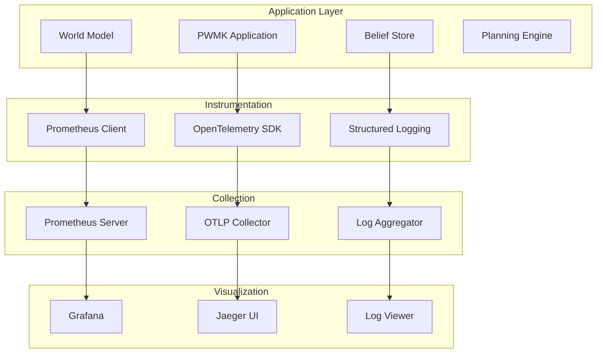

# Monitoring and Observability Guide

## Overview

This document outlines the comprehensive monitoring and observability strategy for the Perspective World Model Kit (PWMK), including metrics collection, logging, tracing, and alerting.

## Monitoring Stack

### Core Components

- **Prometheus**: Metrics collection and storage
- **Grafana**: Visualization and dashboards
- **OpenTelemetry**: Distributed tracing and metrics
- **Loki**: Log aggregation (optional)
- **AlertManager**: Alert routing and notification

### Architecture



## Metrics Collection

### Core Metrics

#### World Model Metrics
```python
from prometheus_client import Counter, Histogram, Gauge

# Training metrics
world_model_training_loss = Histogram(
    'pwmk_world_model_training_loss',
    'World model training loss',
    ['model_type', 'agent_id']
)

world_model_inference_time = Histogram(
    'pwmk_world_model_inference_seconds',
    'Time spent on world model inference',
    ['model_type', 'batch_size']
)

# Memory usage
world_model_memory_usage = Gauge(
    'pwmk_world_model_memory_bytes',
    'Memory usage by world model',
    ['model_type', 'component']
)
```

#### Belief System Metrics
```python
# Belief store operations
belief_query_duration = Histogram(
    'pwmk_belief_query_duration_seconds',
    'Time spent on belief queries',
    ['query_type', 'complexity']
)

belief_store_size = Gauge(
    'pwmk_belief_store_facts_total',
    'Number of facts in belief store',
    ['agent_id', 'predicate_type']
)

belief_update_rate = Counter(
    'pwmk_belief_updates_total',
    'Total number of belief updates',
    ['agent_id', 'update_type']
)
```

#### Planning Metrics
```python
# Planning performance
planning_time = Histogram(
    'pwmk_planning_duration_seconds',
    'Time spent on planning',
    ['planner_type', 'horizon_length']
)

planning_success_rate = Counter(
    'pwmk_planning_attempts_total',
    'Total planning attempts',
    ['planner_type', 'success']
)

plan_quality = Histogram(
    'pwmk_plan_quality_score',
    'Quality score of generated plans',
    ['planner_type', 'goal_type']
)
```

#### Environment Metrics
```python
# Environment performance
env_step_time = Histogram(
    'pwmk_env_step_duration_seconds',
    'Time per environment step',
    ['env_type', 'num_agents']
)

episode_length = Histogram(
    'pwmk_episode_length_steps',
    'Episode length in steps',
    ['env_type', 'success']
)

reward_distribution = Histogram(
    'pwmk_episode_reward',
    'Episode reward distribution',
    ['env_type', 'agent_id']
)
```

### Custom Metrics Implementation

```python
# pwmk/monitoring/metrics.py
from prometheus_client import CollectorRegistry, Counter, Histogram, Gauge
from typing import Dict, Any
import time
from contextlib import contextmanager

class PWMKMetrics:
    """Centralized metrics collection for PWMK."""
    
    def __init__(self, registry: CollectorRegistry = None):
        self.registry = registry or CollectorRegistry()
        self._initialize_metrics()
    
    def _initialize_metrics(self):
        """Initialize all PWMK metrics."""
        # World model metrics
        self.world_model_inference_time = Histogram(
            'pwmk_world_model_inference_seconds',
            'World model inference time',
            ['model_type', 'batch_size'],
            registry=self.registry
        )
        
        # Belief system metrics
        self.belief_query_time = Histogram(
            'pwmk_belief_query_seconds',
            'Belief query execution time',
            ['query_type'],
            registry=self.registry
        )
        
        # Planning metrics
        self.planning_time = Histogram(
            'pwmk_planning_seconds',
            'Planning execution time',
            ['planner_type'],
            registry=self.registry
        )
    
    @contextmanager
    def time_world_model_inference(self, model_type: str, batch_size: int):
        """Context manager for timing world model inference."""
        with self.world_model_inference_time.labels(
            model_type=model_type, 
            batch_size=batch_size
        ).time():
            yield
    
    @contextmanager
    def time_belief_query(self, query_type: str):
        """Context manager for timing belief queries."""
        with self.belief_query_time.labels(query_type=query_type).time():
            yield
    
    @contextmanager
    def time_planning(self, planner_type: str):
        """Context manager for timing planning operations."""
        with self.planning_time.labels(planner_type=planner_type).time():
            yield

# Usage example
metrics = PWMKMetrics()

# In world model code
with metrics.time_world_model_inference("transformer", 32):
    predictions = model.forward(observations)

# In belief store code
with metrics.time_belief_query("complex"):
    results = belief_store.query(query)
```

## Distributed Tracing

### OpenTelemetry Integration

```python
# pwmk/monitoring/tracing.py
from opentelemetry import trace
from opentelemetry.exporter.jaeger.thrift import JaegerExporter
from opentelemetry.sdk.trace import TracerProvider
from opentelemetry.sdk.trace.export import BatchSpanProcessor
from opentelemetry.instrumentation.requests import RequestsInstrumentor
from opentelemetry.instrumentation.sqlalchemy import SQLAlchemyInstrumentor

def setup_tracing(service_name: str = "pwmk"):
    """Setup distributed tracing for PWMK."""
    
    # Create tracer provider
    trace.set_tracer_provider(TracerProvider())
    tracer = trace.get_tracer(__name__)
    
    # Setup Jaeger exporter
    jaeger_exporter = JaegerExporter(
        agent_host_name="localhost",
        agent_port=14268,
        collector_endpoint="http://localhost:14268/api/traces",
    )
    
    # Add span processor
    span_processor = BatchSpanProcessor(jaeger_exporter)
    trace.get_tracer_provider().add_span_processor(span_processor)
    
    # Auto-instrument common libraries
    RequestsInstrumentor().instrument()
    SQLAlchemyInstrumentor().instrument()
    
    return tracer

# Usage in application code
tracer = setup_tracing()

class PerspectiveWorldModel:
    def forward(self, observations, actions):
        with tracer.start_as_current_span(
            "world_model_forward",
            attributes={
                "model.type": "transformer",
                "batch.size": len(observations),
                "model.num_agents": self.num_agents
            }
        ) as span:
            # Model forward pass
            predictions = self._forward_impl(observations, actions)
            
            # Add result attributes
            span.set_attribute("prediction.shape", str(predictions.shape))
            span.set_attribute("prediction.mean", float(predictions.mean()))
            
            return predictions
```

### Custom Span Instrumentation

```python
# pwmk/monitoring/instrumentation.py
from opentelemetry import trace
from functools import wraps
from typing import Dict, Any

def instrument_method(operation_name: str, attributes: Dict[str, Any] = None):
    """Decorator to instrument methods with tracing."""
    def decorator(func):
        @wraps(func)
        def wrapper(*args, **kwargs):
            tracer = trace.get_tracer(__name__)
            
            with tracer.start_as_current_span(
                operation_name,
                attributes=attributes or {}
            ) as span:
                try:
                    result = func(*args, **kwargs)
                    span.set_status(trace.Status(trace.StatusCode.OK))
                    return result
                except Exception as e:
                    span.set_status(
                        trace.Status(
                            trace.StatusCode.ERROR,
                            description=str(e)
                        )
                    )
                    span.record_exception(e)
                    raise
        return wrapper
    return decorator

# Usage example
class BeliefStore:
    @instrument_method("belief_query", {"component": "belief_store"})
    def query(self, query_string: str):
        return self._execute_query(query_string)
    
    @instrument_method("belief_update", {"component": "belief_store"})
    def update_beliefs(self, agent_id: str, observations: Dict[str, Any]):
        return self._update_beliefs_impl(agent_id, observations)
```

## Structured Logging

### Logging Configuration

```python
# pwmk/monitoring/logging.py
import logging
import json
import sys
from datetime import datetime
from typing import Dict, Any

class StructuredFormatter(logging.Formatter):
    """Custom formatter for structured JSON logging."""
    
    def format(self, record: logging.LogRecord) -> str:
        """Format log record as structured JSON."""
        log_entry = {
            'timestamp': datetime.utcnow().isoformat(),
            'level': record.levelname,
            'logger': record.name,
            'message': record.getMessage(),
            'module': record.module,
            'function': record.funcName,
            'line': record.lineno,
        }
        
        # Add extra fields
        if hasattr(record, 'extra_fields'):
            log_entry.update(record.extra_fields)
        
        # Add exception info if present
        if record.exc_info:
            log_entry['exception'] = self.formatException(record.exc_info)
        
        return json.dumps(log_entry)

def setup_logging(level: str = "INFO", format_type: str = "structured"):
    """Setup application logging."""
    
    # Create logger
    logger = logging.getLogger("pwmk")
    logger.setLevel(getattr(logging, level.upper()))
    
    # Create handler
    handler = logging.StreamHandler(sys.stdout)
    
    # Set formatter
    if format_type == "structured":
        formatter = StructuredFormatter()
    else:
        formatter = logging.Formatter(
            '%(asctime)s - %(name)s - %(levelname)s - %(message)s'
        )
    
    handler.setFormatter(formatter)
    logger.addHandler(handler)
    
    return logger

# Usage example
logger = setup_logging(level="INFO", format_type="structured")

class PerspectiveWorldModel:
    def train_step(self, batch):
        logger.info(
            "Starting training step",
            extra={
                'extra_fields': {
                    'batch_size': len(batch),
                    'model_type': 'transformer',
                    'step': self.current_step
                }
            }
        )
```

### Context-Aware Logging

```python
# pwmk/monitoring/context.py
import logging
from contextvars import ContextVar
from typing import Dict, Any

# Context variables for request tracing
request_id: ContextVar[str] = ContextVar('request_id', default='')
agent_id: ContextVar[str] = ContextVar('agent_id', default='')
session_id: ContextVar[str] = ContextVar('session_id', default='')

class ContextFilter(logging.Filter):
    """Add context information to log records."""
    
    def filter(self, record: logging.LogRecord) -> bool:
        """Add context variables to log record."""
        if not hasattr(record, 'extra_fields'):
            record.extra_fields = {}
        
        record.extra_fields.update({
            'request_id': request_id.get(),
            'agent_id': agent_id.get(),
            'session_id': session_id.get(),
        })
        
        return True

# Add context filter to logger
logger = logging.getLogger("pwmk")
logger.addFilter(ContextFilter())

# Usage in application
def process_agent_observation(agent_id_val: str, observation: Dict[str, Any]):
    # Set context
    agent_id.set(agent_id_val)
    request_id.set(f"obs_{uuid.uuid4().hex[:8]}")
    
    logger.info("Processing agent observation")
    # Context automatically included in all subsequent log messages
```

## Dashboards and Visualization

### Grafana Dashboard Configuration

```json
{
  "dashboard": {
    "title": "PWMK Performance Dashboard",
    "panels": [
      {
        "title": "World Model Inference Time",
        "type": "graph",
        "targets": [
          {
            "expr": "histogram_quantile(0.95, pwmk_world_model_inference_seconds_bucket)",
            "legendFormat": "95th percentile"
          },
          {
            "expr": "histogram_quantile(0.50, pwmk_world_model_inference_seconds_bucket)",
            "legendFormat": "Median"
          }
        ]
      },
      {
        "title": "Belief Query Performance",
        "type": "graph",
        "targets": [
          {
            "expr": "rate(pwmk_belief_query_duration_seconds_sum[5m]) / rate(pwmk_belief_query_duration_seconds_count[5m])",
            "legendFormat": "Average query time"
          }
        ]
      },
      {
        "title": "Planning Success Rate",
        "type": "stat",
        "targets": [
          {
            "expr": "rate(pwmk_planning_attempts_total{success=\"true\"}[5m]) / rate(pwmk_planning_attempts_total[5m]) * 100",
            "legendFormat": "Success Rate %"
          }
        ]
      }
    ]
  }
}
```

### Custom Dashboard Panels

```python
# scripts/generate_dashboard.py
import json
from typing import Dict, List, Any

def create_dashboard_panel(
    title: str,
    panel_type: str,
    targets: List[Dict[str, str]],
    **kwargs
) -> Dict[str, Any]:
    """Create a Grafana dashboard panel configuration."""
    
    panel = {
        "title": title,
        "type": panel_type,
        "targets": targets,
        "gridPos": {"h": 8, "w": 12, "x": 0, "y": 0},
    }
    
    panel.update(kwargs)
    return panel

def generate_pwmk_dashboard() -> Dict[str, Any]:
    """Generate PWMK monitoring dashboard."""
    
    panels = [
        create_dashboard_panel(
            title="World Model Training Loss",
            panel_type="graph",
            targets=[
                {
                    "expr": "pwmk_world_model_training_loss",
                    "legendFormat": "Training Loss - {{model_type}}"
                }
            ]
        ),
        create_dashboard_panel(
            title="Memory Usage",
            panel_type="graph",
            targets=[
                {
                    "expr": "pwmk_world_model_memory_bytes",
                    "legendFormat": "Memory - {{component}}"
                }
            ]
        ),
        create_dashboard_panel(
            title="Active Agents",
            panel_type="stat",
            targets=[
                {
                    "expr": "count(pwmk_belief_store_facts_total)",
                    "legendFormat": "Active Agents"
                }
            ]
        )
    ]
    
    dashboard = {
        "dashboard": {
            "title": "PWMK Performance Dashboard",
            "panels": panels,
            "time": {"from": "now-1h", "to": "now"},
            "refresh": "5s"
        }
    }
    
    return dashboard

if __name__ == "__main__":
    dashboard_config = generate_pwmk_dashboard()
    with open("monitoring/grafana/dashboards/pwmk-dashboard.json", "w") as f:
        json.dump(dashboard_config, f, indent=2)
```

## Alerting Configuration

### Prometheus Alert Rules

```yaml
# monitoring/prometheus/alerts.yml
groups:
  - name: pwmk.rules
    rules:
      # High inference latency
      - alert: HighWorldModelLatency
        expr: histogram_quantile(0.95, pwmk_world_model_inference_seconds_bucket) > 0.1
        for: 2m
        labels:
          severity: warning
        annotations:
          summary: "High world model inference latency"
          description: "95th percentile latency is {{ $value }}s"
      
      # Planning failures
      - alert: PlanningFailureRate
        expr: rate(pwmk_planning_attempts_total{success="false"}[5m]) / rate(pwmk_planning_attempts_total[5m]) > 0.1
        for: 5m
        labels:
          severity: critical
        annotations:
          summary: "High planning failure rate"
          description: "Planning failure rate is {{ $value | humanizePercentage }}"
      
      # Memory usage
      - alert: HighMemoryUsage
        expr: pwmk_world_model_memory_bytes > 2e9  # 2GB
        for: 1m
        labels:
          severity: warning
        annotations:
          summary: "High memory usage"
          description: "Memory usage is {{ $value | humanizeBytes }}"
      
      # Belief store size
      - alert: BeliefStoreOverload
        expr: sum(pwmk_belief_store_facts_total) > 10000
        for: 5m
        labels:
          severity: warning
        annotations:
          summary: "Belief store growing too large"
          description: "Belief store contains {{ $value }} facts"
```

### AlertManager Configuration

```yaml
# monitoring/alertmanager/alertmanager.yml
global:
  smtp_smarthost: 'localhost:587'
  smtp_from: 'alerts@pwmk.ai'

route:
  group_by: ['alertname']
  group_wait: 10s
  group_interval: 10s
  repeat_interval: 1h
  receiver: 'web.hook'

receivers:
  - name: 'web.hook'
    slack_configs:
      - api_url: 'https://hooks.slack.com/services/YOUR/SLACK/WEBHOOK'
        channel: '#pwmk-alerts'
        title: 'PWMK Alert'
        text: '{{ range .Alerts }}{{ .Annotations.summary }}{{ end }}'
    
  - name: 'critical'
    email_configs:
      - to: 'team@pwmk.ai'
        subject: 'CRITICAL: {{ .GroupLabels.alertname }}'
        body: |
          {{ range .Alerts }}
          Alert: {{ .Annotations.summary }}
          Description: {{ .Annotations.description }}
          {{ end }}

inhibit_rules:
  - source_match:
      severity: 'critical'
    target_match:
      severity: 'warning'
    equal: ['alertname']
```

## Health Checks and Readiness Probes

### Application Health Endpoints

```python
# pwmk/monitoring/health.py
from fastapi import FastAPI, HTTPException
from typing import Dict, Any
import asyncio
import time

app = FastAPI()

class HealthChecker:
    """Health check implementation for PWMK components."""
    
    def __init__(self):
        self.start_time = time.time()
        self.checks = {
            'world_model': self._check_world_model,
            'belief_store': self._check_belief_store,
            'planning_engine': self._check_planning_engine
        }
    
    async def _check_world_model(self) -> Dict[str, Any]:
        """Check world model health."""
        try:
            # Perform a simple inference check
            # ... health check logic ...
            return {"status": "healthy", "latency_ms": 5.2}
        except Exception as e:
            return {"status": "unhealthy", "error": str(e)}
    
    async def _check_belief_store(self) -> Dict[str, Any]:
        """Check belief store health."""
        try:
            # Check belief store connectivity
            # ... health check logic ...
            return {"status": "healthy", "facts_count": 1500}
        except Exception as e:
            return {"status": "unhealthy", "error": str(e)}
    
    async def _check_planning_engine(self) -> Dict[str, Any]:
        """Check planning engine health."""
        try:
            # Test planning functionality
            # ... health check logic ...
            return {"status": "healthy", "last_plan_time": "2023-07-29T12:00:00Z"}
        except Exception as e:
            return {"status": "unhealthy", "error": str(e)}
    
    async def run_all_checks(self) -> Dict[str, Any]:
        """Run all health checks concurrently."""
        results = {}
        
        # Run checks concurrently
        check_tasks = {
            name: asyncio.create_task(check_func())
            for name, check_func in self.checks.items()
        }
        
        # Wait for all checks to complete
        for name, task in check_tasks.items():
            try:
                results[name] = await asyncio.wait_for(task, timeout=5.0)
            except asyncio.TimeoutError:
                results[name] = {"status": "timeout", "error": "Health check timed out"}
        
        # Determine overall health
        overall_status = "healthy" if all(
            result.get("status") == "healthy" 
            for result in results.values()
        ) else "unhealthy"
        
        return {
            "status": overall_status,
            "uptime_seconds": time.time() - self.start_time,
            "checks": results
        }

health_checker = HealthChecker()

@app.get("/health")
async def health_check():
    """Health check endpoint."""
    health_status = await health_checker.run_all_checks()
    
    if health_status["status"] != "healthy":
        raise HTTPException(status_code=503, detail=health_status)
    
    return health_status

@app.get("/ready")
async def readiness_check():
    """Readiness check endpoint."""
    # Check if application is ready to serve requests
    health_status = await health_checker.run_all_checks()
    
    # Additional readiness checks (database connections, etc.)
    readiness_checks = {
        "database": True,  # Check database connectivity
        "external_apis": True,  # Check external API availability
    }
    
    if not all(readiness_checks.values()):
        raise HTTPException(status_code=503, detail={
            "status": "not_ready",
            "checks": readiness_checks
        })
    
    return {
        "status": "ready",
        "health": health_status,
        "readiness": readiness_checks
    }
```

This comprehensive monitoring and observability framework ensures PWMK systems are fully observable, enabling proactive issue detection and resolution.