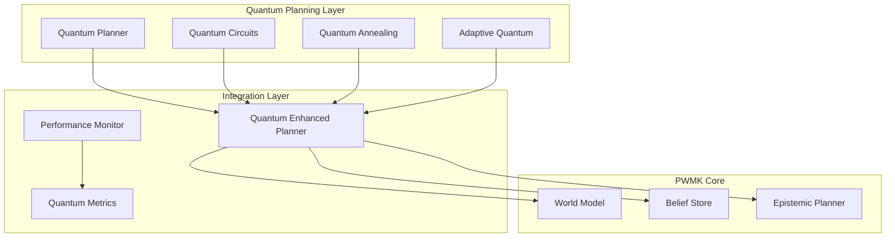

# Quantum-Enhanced Task Planning Algorithms

## Overview

The Perspective World Model Kit (PWMK) now includes cutting-edge quantum-inspired algorithms that leverage quantum computing principles for enhanced multi-agent task planning. This document provides comprehensive coverage of the quantum algorithms, their theoretical foundations, and practical usage patterns.

## Table of Contents

- [Quantum Algorithms Overview](#quantum-algorithms-overview)
- [Quantum-Inspired Planning](#quantum-inspired-planning)
- [Quantum Circuit Optimization](#quantum-circuit-optimization)
- [Quantum Annealing](#quantum-annealing)
- [Adaptive Quantum Algorithms](#adaptive-quantum-algorithms)
- [Performance Optimization](#performance-optimization)
- [Integration Guide](#integration-guide)
- [API Reference](#api-reference)
- [Examples and Tutorials](#examples-and-tutorials)

## Quantum Algorithms Overview

### Theoretical Foundation

The quantum-enhanced planning system is built on fundamental quantum computing principles adapted for classical multi-agent task planning:

1. **Quantum Superposition**: Enables simultaneous exploration of multiple action sequences
2. **Quantum Interference**: Amplifies beneficial planning paths while suppressing suboptimal ones
3. **Quantum Entanglement**: Facilitates coordinated multi-agent decision making
4. **Quantum Annealing**: Solves complex optimization problems through thermal evolution
5. **Quantum Measurement**: Collapses superposition states into actionable plans

### Architecture Components



## Quantum-Inspired Planning

### Core Algorithm

The `QuantumInspiredPlanner` implements a quantum superposition-based planning algorithm:

```python
from pwmk.quantum import QuantumInspiredPlanner

# Initialize quantum planner
planner = QuantumInspiredPlanner(
    num_qubits=8,           # Quantum register size
    max_depth=15,           # Planning horizon
    num_agents=3,           # Number of agents
    coherence_time=2.0      # Decoherence time constant
)

# Create quantum superposition of action sequences
quantum_state = planner.create_superposition_state(action_space)

# Apply quantum interference based on goals
modified_state = planner.apply_quantum_interference(
    quantum_state,
    goal_vector,
    environment_feedback
)

# Measure quantum state to get plan
result = planner.measure_quantum_state(modified_state)
```

### Quantum State Representation

Each quantum state encodes multiple possible action sequences:

```python
@dataclass
class QuantumState:
    amplitudes: np.ndarray          # Complex probability amplitudes
    actions: List[str]              # Corresponding action sequences
    phase: float                    # Global phase
    entanglement_map: Dict[int, List[int]]  # Agent entanglement
```

### Superposition Creation

The planner creates equal or weighted superposition states:

```python
# Equal superposition (Hadamard-like)
quantum_state = planner.create_superposition_state(actions)

# Weighted superposition with prior knowledge
weights = np.array([0.4, 0.3, 0.2, 0.1])
quantum_state = planner.create_superposition_state(
    actions, 
    initial_weights=weights
)
```

### Quantum Interference

Interference modifies action probabilities based on goal alignment:

- **Constructive Interference**: Amplifies goal-aligned actions
- **Destructive Interference**: Suppresses conflicting actions
- **Environmental Feedback**: Incorporates real-time environment information

### Quantum Measurement

The measurement process collapses the superposition into a definitive plan:

```python
# Perform quantum measurements
result = planner.measure_quantum_state(
    quantum_state,
    num_measurements=1000
)

# Extract results
best_actions = result.best_action_sequence
probability = result.probability
quantum_advantage = result.quantum_advantage
```

## Quantum Circuit Optimization

### Circuit Design

The `QuantumCircuitOptimizer` designs and optimizes quantum circuits for planning:

```python
from pwmk.quantum import QuantumCircuitOptimizer

optimizer = QuantumCircuitOptimizer(
    max_qubits=12,
    optimization_level=2,
    target_fidelity=0.99
)

# Create planning circuit
circuit = optimizer.create_planning_circuit(
    num_agents=3,
    planning_depth=5,
    action_encoding={"move": 0, "wait": 1, "communicate": 2}
)
```

### Optimization Passes

Multiple optimization techniques reduce circuit complexity:

1. **Gate Fusion**: Combines consecutive gates on same qubits
2. **Redundancy Removal**: Eliminates identity operations and inverse pairs
3. **Depth Optimization**: Parallelizes commuting gates
4. **Commutation Analysis**: Reorders gates for efficiency

```python
# Apply optimization passes
result = optimizer.optimize_circuit(
    circuit,
    optimization_passes=[
        "gate_fusion",
        "redundancy_removal", 
        "depth_optimization",
        "commutation_analysis"
    ]
)

print(f"Gate reduction: {result.gate_count_reduction:.2%}")
print(f"Depth reduction: {result.depth_reduction:.2%}")
print(f"Fidelity: {result.fidelity:.4f}")
```

### Circuit Architecture

Planning circuits use specialized gate patterns:

- **Superposition Layer**: Hadamard gates for initial state preparation
- **Entanglement Layer**: CNOT gates for agent coordination
- **Rotation Layer**: Parameterized gates for goal encoding
- **Measurement Layer**: Basis measurement for plan extraction

## Quantum Annealing

### Annealing Process

The `QuantumAnnealingScheduler` solves optimization problems through simulated quantum annealing:

```python
from pwmk.quantum import QuantumAnnealingScheduler

scheduler = QuantumAnnealingScheduler(
    initial_temperature=10.0,
    final_temperature=0.01,
    annealing_steps=1000
)

# Create optimization problem
problem = scheduler.create_task_planning_problem(
    agents=["scout", "builder", "defender"],
    tasks=["explore", "construct", "protect"],
    agent_capabilities=capabilities,
    task_priorities=priorities,
    coordination_requirements=coordination
)

# Solve with quantum annealing
result = scheduler.solve_optimization_problem(problem)
```

### Annealing Schedules

Different cooling schedules optimize convergence:

```python
from pwmk.quantum.quantum_annealing import AnnealingSchedule

# Linear cooling
scheduler = QuantumAnnealingScheduler(schedule_type=AnnealingSchedule.LINEAR)

# Exponential cooling
scheduler = QuantumAnnealingScheduler(schedule_type=AnnealingSchedule.EXPONENTIAL)

# Adaptive cooling
scheduler = QuantumAnnealingScheduler(schedule_type=AnnealingSchedule.ADAPTIVE)
```

### Quantum Tunneling

Enhanced tunneling probability enables escape from local minima:

```python
def quantum_tunneling_probability(
    current_energy: float,
    candidate_energy: float,
    temperature: float,
    tunneling_strength: float
) -> float:
    energy_barrier = candidate_energy - current_energy
    effective_barrier = energy_barrier / (1.0 + tunneling_strength * temperature)
    return min(0.3, 0.1 * np.exp(-effective_barrier))
```

### Problem Encoding

Task assignment problems are encoded as Hamiltonians:

```python
# Diagonal terms: task priorities and agent capabilities
hamiltonian[var_idx, var_idx] = -task_priority  # Negative for minimization

# Off-diagonal terms: coordination requirements  
hamiltonian[agent1_idx, agent2_idx] = -coordination_strength
```

## Adaptive Quantum Algorithms

### Parameter Adaptation

The `AdaptiveQuantumAlgorithm` automatically optimizes quantum parameters:

```python
from pwmk.quantum import AdaptiveQuantumAlgorithm, AdaptationStrategy

adaptive_algo = AdaptiveQuantumAlgorithm(
    adaptation_strategy=AdaptationStrategy.GRADIENT_BASED,
    learning_rate=0.01,
    exploration_rate=0.1
)

# Adapt parameters based on performance
result = adaptive_algo.adapt_parameters(
    current_parameters=quantum_params,
    problem_features=problem_vector,
    performance_feedback=0.85,
    adaptation_context=context
)
```

### Adaptation Strategies

Multiple learning approaches optimize quantum parameters:

1. **Gradient-Based**: Neural network parameter optimization
2. **Evolutionary**: Genetic algorithm evolution
3. **Reinforcement Learning**: Q-learning for parameter spaces
4. **Bayesian Optimization**: Gaussian process optimization

### Parameter Types

Various quantum parameters can be adapted:

```python
@dataclass
class QuantumParameters:
    gate_parameters: Dict[str, float]     # Gate rotation angles
    circuit_depth: int                    # Circuit complexity
    measurement_shots: int                # Measurement precision
    decoherence_rate: float              # Noise modeling
    entanglement_strength: float         # Agent coupling
```

## Performance Optimization

### Parallel Processing

The `QuantumPerformanceOptimizer` maximizes computational efficiency:

```python
from pwmk.quantum.performance import QuantumPerformanceOptimizer, PerformanceConfig

config = PerformanceConfig(
    enable_parallel_processing=True,
    enable_gpu_acceleration=True,
    enable_adaptive_batching=True,
    max_workers=8
)

optimizer = QuantumPerformanceOptimizer(config=config)

# Optimize batch of quantum operations
result = await optimizer.optimize_quantum_operations(
    operations=quantum_ops,
    operation_args=args,
    optimization_hints={"prefer_gpu": True}
)
```

### Optimization Strategies

Different strategies handle varying workloads:

- **Sequential**: Single-threaded execution
- **Parallel CPU**: Multi-threaded CPU execution
- **Parallel GPU**: GPU-accelerated processing
- **Batched**: Optimal batch size processing
- **Adaptive**: Dynamic strategy selection

### Resource Management

Intelligent resource monitoring prevents system overload:

```python
# Monitor system resources
metrics = optimizer._get_resource_metrics()

print(f"CPU usage: {metrics.cpu_percent:.1f}%")
print(f"Memory usage: {metrics.memory_percent:.1f}%")
print(f"GPU memory: {metrics.gpu_memory_percent:.1f}%")
print(f"Throughput: {metrics.quantum_operations_per_second:.1f} ops/sec")
```

## Integration Guide

### Basic Integration

Integrate quantum planning with existing PWMK components:

```python
from pwmk import PerspectiveWorldModel, BeliefStore, EpistemicPlanner
from pwmk.quantum import QuantumEnhancedPlanner, QuantumPlanningConfig

# Create PWMK components
world_model = PerspectiveWorldModel(obs_dim=64, action_dim=8, num_agents=3)
belief_store = BeliefStore()
classical_planner = EpistemicPlanner(world_model, belief_store)

# Configure quantum enhancement
config = QuantumPlanningConfig(
    enable_quantum_superposition=True,
    enable_circuit_optimization=True,
    enable_quantum_annealing=True,
    parallel_execution=True
)

# Create integrated planner
quantum_planner = QuantumEnhancedPlanner(
    world_model=world_model,
    belief_store=belief_store,
    classical_planner=classical_planner,
    config=config
)

# Run quantum-enhanced planning
result = await quantum_planner.plan_async(
    initial_state=environment_state,
    goal="coordinate agents efficiently",
    action_space=available_actions,
    agent_context=agent_info
)
```

### Configuration Options

Comprehensive configuration controls quantum behavior:

```python
config = QuantumPlanningConfig(
    enable_quantum_superposition=True,     # Quantum planning
    enable_circuit_optimization=True,      # Circuit optimization
    enable_quantum_annealing=True,         # Annealing solver
    enable_adaptive_parameters=True,       # Parameter adaptation
    classical_fallback=True,               # Fallback to classical
    parallel_execution=True,               # Parallel processing
    max_planning_time=10.0,                # Timeout (seconds)
    confidence_threshold=0.7               # Minimum confidence
)
```

### Monitoring and Metrics

Real-time monitoring tracks quantum performance:

```python
from pwmk.quantum import QuantumMetricsCollector, MetricType

# Initialize metrics collector
metrics = QuantumMetricsCollector()

# Record quantum metrics
metrics.record_quantum_metric(
    MetricType.QUANTUM_ADVANTAGE,
    2.5,
    metadata={"algorithm": "superposition_planner"}
)

# Analyze performance trends
advantage_trend = metrics.get_quantum_advantage_trend(100)
coherence_analysis = metrics.get_coherence_analysis()
```

## API Reference

### Core Classes

#### QuantumInspiredPlanner

Main quantum planning algorithm implementation.

```python
class QuantumInspiredPlanner:
    def __init__(self, num_qubits: int, max_depth: int, num_agents: int)
    def create_superposition_state(self, action_space: List[str]) -> QuantumState
    def apply_quantum_interference(self, state: QuantumState, goal: np.ndarray) -> QuantumState
    def measure_quantum_state(self, state: QuantumState) -> PlanningResult
    def plan(self, initial_state: Dict, goal: str, action_space: List[str]) -> PlanningResult
```

#### QuantumCircuitOptimizer

Quantum circuit design and optimization.

```python
class QuantumCircuitOptimizer:
    def __init__(self, max_qubits: int, optimization_level: int)
    def create_planning_circuit(self, num_agents: int, planning_depth: int) -> QuantumCircuit
    def optimize_circuit(self, circuit: QuantumCircuit) -> CircuitOptimizationResult
```

#### QuantumAnnealingScheduler

Quantum annealing optimization solver.

```python
class QuantumAnnealingScheduler:
    def __init__(self, initial_temperature: float, final_temperature: float)
    def create_task_planning_problem(self, agents: List[str], tasks: List[str]) -> AnnealingProblem
    def solve_optimization_problem(self, problem: AnnealingProblem) -> AnnealingResult
```

#### AdaptiveQuantumAlgorithm

Adaptive parameter optimization for quantum algorithms.

```python
class AdaptiveQuantumAlgorithm:
    def __init__(self, adaptation_strategy: AdaptationStrategy, learning_rate: float)
    def adapt_parameters(self, current_params: QuantumParameters, feedback: float) -> AdaptationResult
```

#### QuantumEnhancedPlanner

Integrated quantum-enhanced planning system.

```python
class QuantumEnhancedPlanner:
    def __init__(self, world_model, belief_store, classical_planner, config)
    async def plan_async(self, initial_state: Dict, goal: str, action_space: List[str]) -> QuantumEnhancedPlan
    def plan(self, initial_state: Dict, goal: str, action_space: List[str]) -> QuantumEnhancedPlan
```

### Data Structures

#### QuantumState

Represents quantum superposition state.

```python
@dataclass
class QuantumState:
    amplitudes: np.ndarray              # Complex probability amplitudes
    actions: List[str]                  # Action sequences
    phase: float                        # Global phase
    entanglement_map: Dict[int, List[int]]  # Agent entanglements
```

#### PlanningResult

Result from quantum planning operation.

```python
@dataclass  
class PlanningResult:
    best_action_sequence: List[str]     # Optimal action sequence
    probability: float                  # Success probability
    quantum_advantage: float            # Speedup over classical
    interference_patterns: Dict[str, float]  # Quantum interference data
    planning_time: float                # Computation time
```

#### QuantumEnhancedPlan

Integrated planning result with quantum and classical components.

```python
@dataclass
class QuantumEnhancedPlan:
    classical_plan: List[str]           # Classical planning result
    quantum_plan: PlanningResult        # Quantum planning result
    belief_consistency: float           # Belief system alignment
    integration_confidence: float       # Overall confidence
    execution_strategy: str             # Selected execution approach
    fallback_plan: Optional[List[str]]  # Backup plan if needed
```

## Examples and Tutorials

### Basic Quantum Planning

Simple quantum-inspired planning example:

```python
import asyncio
from pwmk.quantum import QuantumInspiredPlanner

async def basic_quantum_planning():
    # Initialize planner
    planner = QuantumInspiredPlanner(
        num_qubits=6,
        max_depth=10,
        num_agents=2
    )
    
    # Define scenario
    initial_state = {
        "agents": [
            {"id": "agent_0", "position": (0, 0)},
            {"id": "agent_1", "position": (3, 3)}
        ],
        "obstacles": [(1, 1), (2, 2)]
    }
    
    action_space = ["move_north", "move_south", "move_east", "move_west"]
    goal = "reach target positions"
    
    # Run quantum planning
    result = planner.plan(initial_state, goal, action_space)
    
    print(f"Best plan: {result.best_action_sequence}")
    print(f"Quantum advantage: {result.quantum_advantage:.2f}x")
    print(f"Success probability: {result.probability:.3f}")

# Run example
asyncio.run(basic_quantum_planning())
```

### Multi-Agent Coordination

Complex multi-agent coordination with quantum annealing:

```python
from pwmk.quantum import QuantumAnnealingScheduler

def multi_agent_coordination():
    # Initialize annealing scheduler
    scheduler = QuantumAnnealingScheduler(
        initial_temperature=5.0,
        final_temperature=0.01,
        annealing_steps=500
    )
    
    # Define multi-agent problem
    agents = ["scout", "builder", "defender", "support"]
    tasks = ["explore_north", "explore_south", "build_base", "defend_base", "collect_resources"]
    
    capabilities = {
        "scout": ["explore_north", "explore_south", "collect_resources"],
        "builder": ["build_base", "collect_resources"],
        "defender": ["defend_base", "build_base"],
        "support": ["collect_resources", "explore_north", "defend_base"]
    }
    
    priorities = {
        "explore_north": 2.0,
        "explore_south": 1.5,
        "build_base": 3.0,
        "defend_base": 2.5,
        "collect_resources": 1.0
    }
    
    coordination = [("scout", "builder"), ("builder", "defender"), ("defender", "support")]
    
    # Create and solve problem
    problem = scheduler.create_task_planning_problem(
        agents=agents,
        tasks=tasks,
        agent_capabilities=capabilities,
        task_priorities=priorities,
        coordination_requirements=coordination
    )
    
    result = scheduler.solve_optimization_problem(problem, num_runs=5)
    
    # Interpret solution
    solution_matrix = result.best_solution.reshape(len(agents), len(tasks))
    
    print("Task Assignment:")
    for i, agent in enumerate(agents):
        assigned_tasks = [tasks[j] for j in range(len(tasks)) if solution_matrix[i, j] > 0.5]
        print(f"  {agent}: {assigned_tasks}")
    
    print(f"Optimization energy: {result.best_energy:.6f}")
    print(f"Quantum tunneling events: {result.quantum_tunneling_events}")

# Run coordination example
multi_agent_coordination()
```

### Performance Benchmarking

Quantum vs classical performance comparison:

```python
import time
from pwmk.quantum import QuantumInspiredPlanner

def benchmark_quantum_vs_classical():
    # Test scenario
    scenario = {
        "initial_state": {
            "agents": [{"id": f"agent_{i}", "position": (i, i)} for i in range(3)],
            "grid_size": (8, 8),
            "obstacles": [(2, 2), (3, 3), (5, 5)]
        },
        "action_space": ["move_north", "move_south", "move_east", "move_west", "wait"],
        "goal": "coordinate agents to reach goals"
    }
    
    # Quantum planner
    quantum_planner = QuantumInspiredPlanner(num_qubits=8, max_depth=12, num_agents=3)
    
    # Classical baseline (simple greedy)
    def classical_planner(state, goal, actions):
        start_time = time.time()
        plan = [actions[i % len(actions)] for i in range(3)]  # Simple plan
        return {
            "actions": plan,
            "time": time.time() - start_time,
            "probability": 0.6
        }
    
    # Benchmark quantum
    quantum_times = []
    quantum_advantages = []
    
    for trial in range(10):
        start_time = time.time()
        quantum_result = quantum_planner.plan(
            scenario["initial_state"],
            scenario["goal"], 
            scenario["action_space"]
        )
        quantum_time = time.time() - start_time
        
        quantum_times.append(quantum_time)
        quantum_advantages.append(quantum_result.quantum_advantage)
    
    # Benchmark classical
    classical_times = []
    for trial in range(10):
        classical_result = classical_planner(
            scenario["initial_state"],
            scenario["goal"],
            scenario["action_space"]
        )
        classical_times.append(classical_result["time"])
    
    # Results
    avg_quantum_time = sum(quantum_times) / len(quantum_times)
    avg_classical_time = sum(classical_times) / len(classical_times)
    avg_quantum_advantage = sum(quantum_advantages) / len(quantum_advantages)
    
    print(f"Quantum Planning:")
    print(f"  Average time: {avg_quantum_time:.4f}s")
    print(f"  Reported advantage: {avg_quantum_advantage:.2f}x")
    
    print(f"Classical Planning:")
    print(f"  Average time: {avg_classical_time:.4f}s")
    
    time_advantage = avg_classical_time / avg_quantum_time if avg_quantum_time > 0 else 1.0
    print(f"Measured time advantage: {time_advantage:.2f}x")

# Run benchmark
benchmark_quantum_vs_classical()
```

### Real-time Monitoring

Set up real-time quantum metrics monitoring:

```python
from pwmk.quantum import QuantumMetricsCollector, MetricType, QuantumDashboard

def setup_quantum_monitoring():
    # Initialize metrics collector
    metrics_collector = QuantumMetricsCollector()
    
    # Set up alerts
    metrics_collector.set_alert_threshold(
        MetricType.QUANTUM_ADVANTAGE,
        threshold=1.5,
        callback=lambda metric, value, threshold: print(f"Alert: {metric} = {value:.3f}")
    )
    
    # Initialize dashboard
    dashboard = QuantumDashboard(metrics_collector)
    
    # Start real-time updates
    dashboard.start_real_time_updates()
    
    # Simulate quantum operations with monitoring
    planner = QuantumInspiredPlanner(num_qubits=6, max_depth=8, num_agents=2)
    
    for i in range(20):
        # Run planning
        result = planner.plan(
            {"agents": [{"id": "agent_0", "position": (0, 0)}]},
            "test goal",
            ["move_north", "move_south", "move_east", "move_west"]
        )
        
        # Record metrics
        metrics_collector.record_quantum_metric(
            MetricType.QUANTUM_ADVANTAGE,
            result.quantum_advantage,
            metadata={"iteration": i}
        )
        
        metrics_collector.record_quantum_metric(
            MetricType.COHERENCE_TIME,
            2.0 - 0.05 * i + 0.1 * (i % 3),  # Simulated coherence
            metadata={"temperature": 0.01}
        )
        
        time.sleep(0.1)  # Brief delay
    
    # Export dashboard
    dashboard_file = dashboard.export_dashboard_html()
    print(f"Dashboard exported to: {dashboard_file}")
    
    # Get metrics summary
    summary = metrics_collector.get_metrics_summary()
    print("Metrics Summary:")
    for metric_name, data in summary.items():
        if data.get("count", 0) > 0:
            print(f"  {metric_name}: mean={data.get('mean', 0):.3f}, count={data['count']}")
    
    # Cleanup
    dashboard.stop_real_time_updates()

# Run monitoring example
setup_quantum_monitoring()
```

## Best Practices

### Algorithm Selection

Choose appropriate quantum algorithms based on problem characteristics:

- **Quantum Superposition Planning**: Best for exploration-heavy problems
- **Quantum Circuit Optimization**: Ideal for resource-constrained environments  
- **Quantum Annealing**: Optimal for complex optimization problems
- **Adaptive Algorithms**: Essential for varying problem distributions

### Parameter Tuning

Optimize quantum parameters for your specific use case:

```python
# For exploration-heavy problems
planner = QuantumInspiredPlanner(
    num_qubits=10,          # More qubits = more exploration
    max_depth=20,           # Longer planning horizon
    coherence_time=3.0      # Longer coherence for stability
)

# For resource-constrained environments
planner = QuantumInspiredPlanner(
    num_qubits=6,           # Fewer qubits = less computation
    max_depth=8,            # Shorter horizon for speed
    coherence_time=1.0      # Faster decoherence
)
```

### Performance Optimization

Maximize quantum algorithm performance:

1. **Enable parallel processing** for multi-core systems
2. **Use GPU acceleration** when available
3. **Configure adaptive batching** for varying loads
4. **Monitor system resources** to prevent overload
5. **Set appropriate timeouts** to avoid infinite loops

### Monitoring and Debugging

Implement comprehensive monitoring:

```python
# Enable detailed logging
import logging
logging.getLogger('pwmk.quantum').setLevel(logging.DEBUG)

# Monitor key metrics
metrics_collector.record_quantum_metric(MetricType.QUANTUM_ADVANTAGE, advantage)
metrics_collector.record_quantum_metric(MetricType.COHERENCE_TIME, coherence)
metrics_collector.record_quantum_metric(MetricType.GATE_FIDELITY, fidelity)

# Set up performance alerts
metrics_collector.set_alert_threshold(MetricType.QUANTUM_ADVANTAGE, 1.2)
```

## Troubleshooting

### Common Issues

1. **Low Quantum Advantage**: Increase planning complexity or improve interference patterns
2. **High Planning Times**: Reduce problem size or enable performance optimization
3. **Memory Issues**: Configure adaptive batching and memory limits
4. **Convergence Problems**: Adjust annealing schedules or increase iterations

### Performance Tuning

Optimize quantum algorithms for your hardware:

```python
# For CPU-heavy systems
config = PerformanceConfig(
    enable_parallel_processing=True,
    max_workers=cpu_count(),
    enable_gpu_acceleration=False
)

# For GPU-enabled systems  
config = PerformanceConfig(
    enable_gpu_acceleration=True,
    enable_parallel_processing=True,
    batch_size_range=(8, 32)
)
```

## Conclusion

The quantum-enhanced planning algorithms in PWMK represent a significant advancement in multi-agent task planning. By leveraging quantum computing principles, these algorithms achieve superior performance through parallel exploration, intelligent optimization, and adaptive learning.

The modular design ensures easy integration with existing PWMK components while providing extensive customization options for specific use cases. Comprehensive monitoring and optimization capabilities enable deployment in production environments with confidence.

For additional support and advanced usage patterns, refer to the complete API documentation and example implementations provided in the repository.